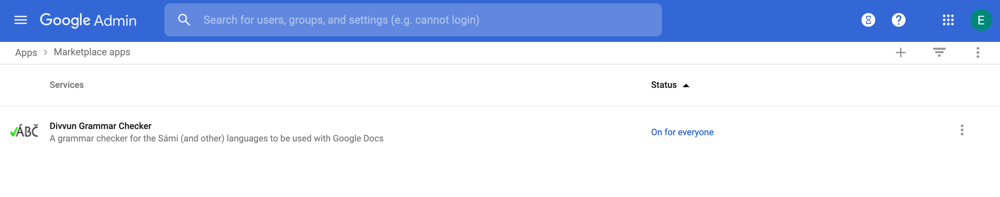
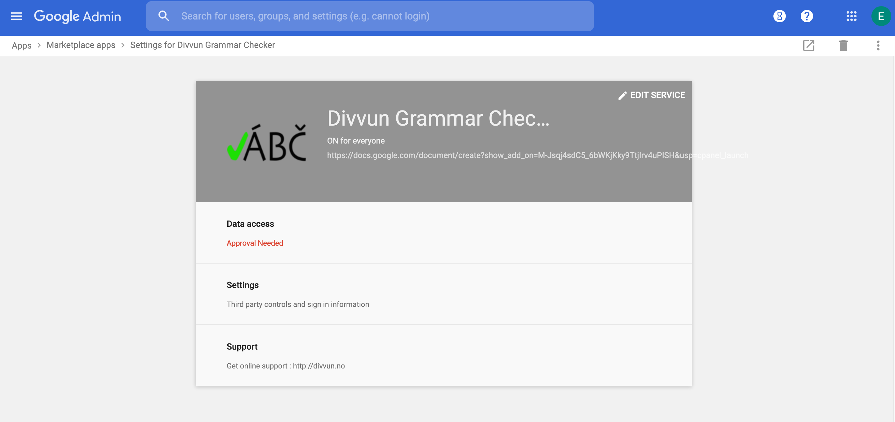

# Installing

There are two ways to install the addon. Either domain-wide as a GSuite Addon or as a private Chrome Web Store addon.

## GSuite
To install the addon domain-wide through GSuite, following the following link and chose to install the addon on the domain: https://gsuite.google.com/u/0/marketplace/app/divvun_grammar_checker/611280167256

A domain administrator then needs to enable the addon in the GSuite admin panel.

1) Login to the admin panel on https://admin.google.com
2) Find the "Divvun Grammar Checker" addon in the Marketplace apps "App"

3) Click on "Data access" and allow the addon access

4) Wait up to 24 hours
5) The "Divvun Grammar Checker" option should appear in the Google Docs "Add-Ons" menu

To install the addon for a private user (GMail), install the addon from the above link and the add-on should appear in Google Docs within 24h.

## Chrome Web Store
To install the one for a GMail user, navigate to https://chrome.google.com/webstore/detail/divvun-grammar-checker/bbbegmecpfjmfngngnehclkfdfkbieen?authuser=0 and press "Install". The addon should appear in the addon list.
