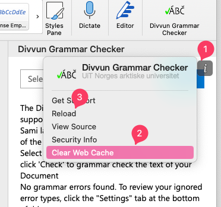

# Sami Grammar Checker for MS Office Online

The grammar checker is an add-on to MS Office Online and more specifically Word.

# Requirements

- Node.js (> 10.0)
- npm

You will also need to add the self-signed certificate to your chain of trust. If you're using Chrome/Safari for Windows or macOS you can follow the instructions here: https://github.com/OfficeDev/generator-office/blob/master/src/docs/ssl.md
If you're using Firefox you can go to `Preferences` > `Privacy & Security`, then scroll to the bottom and under the `Certificates` section click on the `View Certificates` button. In the opened modal window, under the `Authorities` tab,
click `Import...` and select the file `certs/ca.crt`.

# Development setup

Steps to run this in a development environment:

1. npm install
2. npm start

When this inevitably fails, may we suggest accepting our lord and saviour docker into your hearts and going

```bash
docker run --platform linux/amd64 --rm -ti -p 3000:3000 -v $(pwd):/app node:10 bash
# cd /app
# npm install
# npm start
```

This will have you running a local server at port 3000. Then depending on which Word you want to test,
you need to provide the `manifest.xml` file to Word in a different way.

## Online

You need to upload the manifest file in order to test the add-in. Follow the instructions on https://docs.microsoft.com/en-us/office/dev/add-ins/testing/sideload-office-add-ins-for-testing#sideload-an-office-add-in-in-office-online

## iPad and Mac

In order to provide your `manifest.xml` follow these instructions:
https://docs.microsoft.com/en-us/office/dev/add-ins/testing/sideload-an-office-add-in-on-ipad-and-mac

If you want to debug on the iPad or Mac, follow these instructions to get access to some debug tools and the console:
https://docs.microsoft.com/en-us/office/dev/add-ins/testing/debug-office-add-ins-on-ipad-and-mac


# Publishing

The [Divviun Grammar Checker](https://appsource.microsoft.com/en-us/product/office/WA200001000?tab=Overview) is published at [Microsoft Partner Center](https://partner.microsoft.com/nb-no/dashboard/office/products/c280f9cf-93a4-4916-b322-f6d3c13d955a/setup). You'll need to login with divvunuit@gmail.com

There's a checklist of stuff to do before publishing - it lives [here](https://learn.microsoft.com/en-us/partner-center/marketplace/checklist). Saying that as a reference only. Technically there shouldn't be much more stuff in here.

Unlike google docs, the microsoft add-in:s are hosted by us. So. We provide microsoft with a manifest that points to the URL we'd like the server to load. The URL lives on our webserver - https://api-giellalt.uit.no/msoffice/index.html

So unless we need to make changes to any of the URLs, we can ignore updating the manifest and just update the hosting files on api-giellalt.uit.no . This is shoe-horned in on the divvun-api server. 

So.. 

```bash
docker run --platform linux/amd64 --rm -ti -p 3000:3000 -v $(pwd):/app node:10 bash
cd app
npm i
npm run build
exit
```

Now you have a dist folder filled with happy dist files. This is your Add-in (previously Add-on). You can follow the instruction here https://github.com/divvun/divvun-api/blob/1bb26c4b8e40a3665c189800027b4c3a7afd7e5f/deployment/README.md to generate a full deployment set that deploys not only this content, but also all the other divvun components. 

You can also just replace the contents of the dist-folder with your new add-in. Either way, you'll need your public key added to the set of known keys on api-giellalt.uit.no first. 

```bash
cd dist
tar czvf dist.tar.gz *
cd ..
mv dist/dist.tar.gz .
scp dist.tar.gz root@api-giellalt.uit.no:/tmp/dist.tar.gz
ssh root@api-giellalt.uit.no
cd /home/api/dist
rm -rf msoffice.new
mkdir msoffice.new
cd msoffice.new
tar xvf /tmp/dist.tar.gz
cd ..
mv msoffice msoffice$(date +"%Y%m%d%H%M%S")
mv msoffice.new msoffice
exit
rm dist.tar.gz
echo "Done"
```

Remember to run your tests with the cache disabled. When in word, hover the grammar checker until the "i" appears __(1)__, click it and then clear the web cache __(2)__ and reload __(3)__ in the menu that appears:


